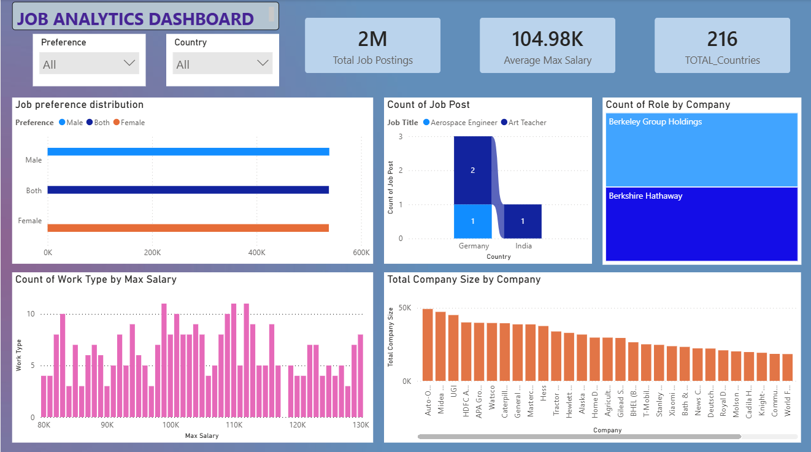

<h1>Task 1 - Preference vs Work Type </h1>
Visualization: Clustered Bar Chart

**Task**
Preference vs Work Type: Create a clustered bar chart to visualize the relationship between Preference and Work Type, considering only job postings where Work Type = "Intern". Apply the following filters: Company Size less than 50,000 and Salary greater than $9,000. Finally, sort the chart in descending order based on the number of job postings (count). This visualization helps identify how different job preferences are distributed across internship opportunities after applying the specified filters.

Apply the following filters:

<ul>
<li>Company Size < 50,000</li>
<li>Salary > $9,000</li>
</ul>
Sort the chart in descending order based on the number of job postings.

<h1>Task 2 - Company Size Analysis </h1>

Company Size vs Company Name: Create a Clustered Column Chart to display the average Company Size for each Company Name. Apply the following filters: Company Size less than 50,000, Job Title = "Mechanical Engineer", Experience greater than 5 years, Salary greater than $50,000, Work Type = Full-Time or Part-Time, Preference = Male, Country does not start with the letter "I", Job Portal = Idealist, and Company Name contains at least two vowels. Sort the companies by Average Company Size and display only the Top 15 companies. This visualization helps compare the average size of selected companies that meet the specified criteria.

use a Clustered Column Chart.

Visualization: Clustered Column Chart

X-Axis: Company Name

Y-Axis: Average Company Size

Filters
1. Company Size < 50,000
2. Job Title = Mechanical Engineer
3. Experience > 5 Years
4. Salary > $50,000
5. Work Type = Full-Time OR Part-Time
6. Preference = Male
7. Country does NOT start with "I"
8. Job Portal = Idealist
9. Company Name contains at least two vowels

Sort companies by Company Size.

<h1>Task 3 - Work Type Salary Distribution</h1>

Work Type Salary Distribution: Create a Histogram to visualize the distribution of Salary using 20 bins. Apply the following filters: Work Type = "Intern", Company Size less than 50,000, Salary greater than $8,000, Job Title length less than 10 characters, Experience is an even number, Posting Year between 2021 and 2023, and Contact Person contains the letter "e". This visualization helps analyze the salary distribution of internship opportunities that satisfy the specified conditions.

Visualization: Histogram

Filters
1. Work Type = Intern
2. Latitude < 10
3. Company Size < 50,000
4. Salary > $8,000
5. Job Title contains only one word
6. Job Title length < 10
7. Experience is an even number
8. Posting Year between 2021 and 2023
9. Contact Person contains letter "e"

<h1>Task 4 - India vs Germany Comparison</h1>

Visualization: Stacked Column Chart

Axis: Country

Legend: Job Title

Values: Count of Job Postings

Filters
*Country = India or Germany
*Qualification = B.Tech
*Work Type = Full-Time
*Experience > 2
*Job Title: Data Scientist, Art Teacher, Aerospace Engineer
*Salary > $10,000
*Job Portal = Indeed
*Company Name length > 8
Location not blank

Use different colors for each country.

<h1>Task 5 - Top 10 Companies</h1>

Treemap is supported.

Visualization: Treemap

Group: Company Name

Values: Count of Jobs

Top N Filter: Top 10 Companies

**Additional Filters**
*Role = Data Engineer
*Job Title = Data Scientist
*Country NOT in Asia
*Country does NOT start with "C"
*Company Size ≥ 10,000
*Qualification = B.Tech
*Preference = Female
*Job Portal = LinkedIn
*Posting Date between: 01-Jan-2023 to 06-Jan-2023
*Contact Person ends with a vowel

<h1>Final Dashboard </h1>

